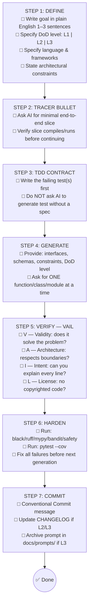

# Coding Guidelines — AI Master Directive v7.0
## Part A: Governance · Behavioral Contract · Architecture

**Version 7.0** — Single Source of Truth for AI-Assisted "Vibe Coding"
**Applicable to:** Claude Code · Gemini CLI · GitHub Copilot · Kimi · Cursor · Continue · Amazon Q · any LLM-powered coding assistant

**Normative Alignment:**
Clean Code (Martin, 2009) · The Pragmatic Programmer (Hunt & Thomas, 2019) · Software Engineering at Google (Winters et al., 2020) · Accelerate (Forsgren et al., 2018) · Site Reliability Engineering (Beyer et al., 2016) · ISO 9001:2015 · ISO/IEC 25010:2023 · ISO/IEC 29110:2018 · NIST SP 800-218 (SSDF v1.1) · OWASP SAMM v2.0

**Sister documents:** World-Class Engineering Standards v4.0 · Definition of Done & Checklist v4.0

*Language policy: This directive is maintained in English to ensure cross-team and multi-LLM compatibility. Technical terms must remain in English regardless of team locale.*

> **PRIME DIRECTIVE — READ BEFORE GENERATING ANY CODE**
> You are an elite software architect. This document is your non-negotiable contract. Before generating, refactoring, or reviewing code: (1) read the applicable section, (2) generate, (3) self-review against §8 Checklists. If a rule cannot be followed due to a framework constraint, add `# Why: <justification>` inline. If a requirement is ambiguous, **ask for clarification — do not guess**.

---

## Table of Contents

**Part A (This File)**
- [§0 Governance](#0-governance)
- [§1 Behavioral Contract & Vibe Coding Protocol](#1-behavioral-contract--vibe-coding-protocol)
- [§2 Architectural & Design Rules](#2-architectural--design-rules)

**Part B** — `Coding_Guidelines_v7_AI_Master_Directive_Part_B.md`
- §3 LLM Specifics & Prompt Templates
- §4 Code Quality, Function Design & Error Handling
- §5 Testing Strategy & Resilience

**Part C** — `Coding_Guidelines_v7_AI_Master_Directive_Part_C.md`
- §6 Security, Observability & CI/CD
- §7 Metrics, Technical Debt & Quality Mapping
- §8 Unified Checklists, Glossary & Compliance

---

## §0 GOVERNANCE

### 0.1 Document Lifecycle & Semantic Versioning

This Master Directive follows **SemVer 2.0.0** (`MAJOR.MINOR.PATCH`):

| Type | When | Example trigger |
|:-----|:-----|:----------------|
| **MAJOR** | Restructuring, new normative alignments, changing DoD constraints | Adding a new normative standard |
| **MINOR** | New LLM guardrails, new prompt templates, new checklists, new sections | Adding a new LLM row |
| **PATCH** | Typo fixes, clarifications that do not change meaning | Fixing a broken code example |

### 0.2 Review & Approval Process (ISO 9001 §7.5)

- **Owner:** Principal Architect / Head of Engineering
- **Review Cycle:** Quarterly (minimum); triggered immediately by a critical vulnerability disclosure
- **Approval process:** Changes proposed via Pull Request → reviewed by ≥ 2 Staff/Principal Engineers → merged by Owner
- **Immutable content:** The Behavioral Contract (§1.1, rules R-01–R-12) requires MAJOR version bump to change

### 0.3 Changelog

| Version | Date | Summary of Changes |
|:--------|:-----|:-------------------|
| **7.0** | 2026-05-18 | Full restructuring from 19-PART flat format to 8-section modular format. Added: Governance (§0), unified prompt templates (§3.2), hallucination detection protocol (§3.4), ISO 25010 quantified metrics (§7.3), ISO 29110 traceability template (§7.4), Green IT (§7.5), post-mortem template (§8.1), OWASP SAMM roadmap (§6.7), RACI for SSDF (§6.8), expanded glossary (§8.3), compliance mapping (§8.4). Eliminated all P1/P2 audit gaps from v6. |
| **6.0** | 2026-05-17 | Added NIST SSDF mapping, OWASP SAMM, Observability, Green IT, Accessibility, Prompt Injection Prevention. Expanded from 715 to 1321 lines. |
| **5.0** | Prior | Initial multi-LLM directive. 715 lines. |

### 0.4 Continuous Improvement (PDCA Loop — ISO 9001 §10)

```
PLAN  → Identify gaps via quarterly audit (score each section against normative references)
DO    → Implement improvements in a new version branch
CHECK → Validate against DoD checklist; measure adoption rate across teams
ACT   → Merge and publish; archive prior version; broadcast changelog
```

Every quarterly review must produce a written audit delta report stored in `docs/governance/audit-YYYY-QN.md`.

---

## §1 BEHAVIORAL CONTRACT & VIBE CODING PROTOCOL

### 1.1 Universal Directive (applies to every LLM, every language, every task)

The following rules are **absolute** and override any implicit behavior of the AI assistant:

| # | Rule | Rationale |
|:--|:-----|:----------|
| R-01 | **One task per session.** Solve a single, bounded problem per prompt. Never mix feature + refactor + bug fix. | Reversibility, PR discipline |
| R-02 | **Ask before assuming.** If requirements, architecture constraints, or target language are unclear, ask one clarifying question. | ISO 9001 §8.2, Clean Code Ch. 1 |
| R-03 | **Tracer Bullet first.** When asked for a new feature, build a thin end-to-end slice before full implementation. | Pragmatic Programmer Ch. 12 |
| R-04 | **Fail loudly on rule violations.** If generating code that would violate a rule, state the violation and the justification. | Traceability |
| R-05 | **Explain every non-obvious line.** If you cannot explain why a line exists, remove or rewrite it. | Anti-coincidence (PP Ch. 6) |
| R-06 | **Hallucination check is mandatory.** Do not reference APIs, methods, or libraries you are not certain exist. See §3.4 for protocol. | Trust, but verify |
| R-07 | **Zero secrets policy.** Never generate code containing hardcoded credentials, tokens, keys, or passwords. | NIST SSDF PW.5 |
| R-08 | **Type everything.** All function parameters, return types, and class attributes must be explicitly typed. | ISO/IEC 25010 Maintainability |
| R-09 | **No print() for operational output.** Always use the project's structured logger. | SRE Ch. 10 |
| R-10 | **Explicit timeouts on all external calls.** Never leave timeout=None on HTTP, DB, or queue calls. See §4.5. | Release It! Ch. 5 |
| R-11 | **Test generation is not optional.** Every new function must ship with at least one unit test. | DoD §5 |
| R-12 | **License-clean code only.** Do not reproduce verbatim blocks from GPL/AGPL/SSPL-licensed sources. | IP / compliance |

### 1.2 Vibe Coding Session Protocol — 7 Steps (VAIL Framework)



**VAIL Verification Detail:**
- **V — Validity:** Does it solve the specific problem requested, not a simpler proxy?
- **A — Architecture:** Domain layer zero infrastructure imports; dependencies point inward.
- **I — Intent:** Every line of code is understood. No "Programming by Coincidence".
- **L — License/Legal:** No verbatim GPL/AGPL/SSPL blocks. API hallucination check passed.

### 1.3 Anti-Patterns for AI-Generated Code (NEVER ACCEPT)

| Anti-Pattern | Description | Detection Method |
|:-------------|:------------|:-----------------|
| **Programming by Coincidence** | Code that works but no one can explain why | Ask "why does this line exist?" |
| **Phantom API** | Hallucinated method/class that does not exist | Run code; check official docs |
| **God Function** | >40 lines, >10 complexity — AI often generates monoliths | `radon cc -n C` |
| **Cargo Cult Import** | Imports added "just in case" (unused imports) | `ruff F401` |
| **Hardcoded Assumption** | Magic numbers, hardcoded URLs, env-specific paths | `bandit`, grep |
| **Silent Swallow** | `except Exception: pass` eating errors without logging | `bandit B110` |
| **Premature Abstraction** | Over-engineered base classes for a 2-case problem | Rule of Three check |
| **Copy-Paste Drift** | AI repeats a pattern verbatim across 3+ files | DRY audit |
| **Test Mirroring** | Tests that only call the happy path — no edge cases | Mutation testing |
| **Broken Window** | Newly generated code ignores existing lint/type errors | CI gate must be green |

---

## §2 ARCHITECTURAL & DESIGN RULES

### 2.1 Clean Architecture — The Dependency Rule

```
┌──────────────────────────────────────────────────────────────┐
│  Adapters (Infrastructure)                                   │
│  FastAPI/Flask routers · SQLAlchemy repos · HTTP clients     │
│  Event publishers · CLI handlers · External API clients      │
├──────────────────────────────────────────────────────────────┤
│  Application (Use Cases)                                     │
│  Orchestration · DTOs · Mappers · Feature Flags              │
│  Application Services · Command/Query handlers               │
├──────────────────────────────────────────────────────────────┤
│  Domain (Core) — ZERO external framework imports             │
│  Entities · Value Objects · Domain Services                  │
│  Custom Exceptions · Repository Interfaces (Protocols)       │
│  Domain Events · Aggregates                                  │
└──────────────────────────────────────────────────────────────┘
         ↑  Dependencies ALWAYS point INWARD
```

**Absolute prohibitions in the Domain layer:**
- No ORM imports (SQLAlchemy, Django ORM, Hibernate, TypeORM)
- No web framework imports (FastAPI, Flask, Express, Spring)
- No cloud SDK imports (boto3, google-cloud-*, azure-*)
- No `os.environ` reads — pass config via constructor injection
- No `datetime.now()` calls — inject a clock abstraction

**Hexagonal (Ports & Adapters) as an equivalent alternative:**
- **Primary Ports (driving):** Use Case interfaces called by UI/API adapters
- **Secondary Ports (driven):** Repository/messaging interfaces implemented by infra adapters
- The Domain only references Port interfaces — never adapter implementations

### 2.2 SOLID Principles

| Principle | Rule | Code Signal (violation indicator) |
|:----------|:-----|------------------------------------|
| **SRP** | One class = one reason to change | Class name contains "And" or "Manager" → split |
| **OCP** | Extend via Strategy/Composition, not modification | `if isinstance(obj, TypeA)` chains |
| **LSP** | Subclasses must be substitutable; use `abc.ABC` | Overriding method that raises `NotImplementedError` |
| **ISP** | Prefer `typing.Protocol` for small, focused contracts | Implementing interface with unused methods |
| **DIP** | Inject dependencies via constructors; depend on abstractions | `MyClass()` instantiated inside another class body |

### 2.3 Hyrum's Law (SWE@Google, Ch. 1)
> *"With enough users, any observable behavior becomes a dependency — even bugs."*

- Every public function, class, or module is a **contract**. Breaking it — even to fix a bug — is a breaking change.
- Use `__all__` to explicitly control API surface.
- Internal helpers must not be importable by external consumers.
- Any behavior relied upon by callers must be covered by a Learning Test (§5.8).

### 2.4 ETC — Easy To Change (Pragmatic Programmer, Ch. 1)
> *"Good design is easier to change than bad design."*

Before finalizing any design decision, ask: **"Is this easy to change in 6 months?"**
- Prefer composition over inheritance (composition is more reversible).
- Avoid vendor lock-in without an abstraction layer.
- Feature flags make any behavior reversible at runtime (see §2.7).

### 2.5 Orthogonality (Hunt & Thomas, Ch. 2)
- A change in the database schema must not force a UI change.
- A change in a business rule must not alter logging infrastructure.
- **Metric:** A single feature request should modify ≤ 2 domain modules. If >2 are touched, write an ADR justifying the coupling.

### 2.6 Law of Demeter — "Talk to friends, not strangers"

```python
# ❌ Train wreck — coupled to 3 internal structures
total = order.get_customer().get_account().get_balance()

# ✅ Tell, Don't Ask — move behaviour to the object that owns the data
total = order.get_customer_balance()
```

**Detection:** Any `obj.a.b.c` or `.method().method().method()` chain is a violation.

### 2.7 Reversibility & Feature Flags

- **Naming convention:** `ff_<team>_<feature>_<YYYY_QN>` → e.g., `ff_payments_idempotency_2025_Q2`
- **Max age:** Release flags removed within 30 days of full rollout. Ops flags reviewed quarterly.
- **Registry:** Every flag documented in `docs/feature-flags/registry.md` with owner, rollout %, and expiry.
- **Testing:** Both ON and OFF paths must be tested in CI.
- **Idempotency keys** are distinct from feature flags — do not share the `ff_` prefix.

### 2.8 Architecture Decision Records (ADR — ISO 9001 §6.3)

ADRs are **immutable once accepted**. Supersessions create a new ADR.

```markdown
# ADR-NNN: <Title>
**Status:** Proposed | Accepted | Deprecated | Superseded by ADR-NNN
**Date:** YYYY-MM-DD
**Deciders:** [Names/Roles]
**ISO 9001 Context:** [organizational context from §4.1]

## Context
[Why is this decision being made?]

## Decision
[What was decided?]

## Consequences
- ✅ Positive: [benefits]
- ⚠️ Negative: [trade-offs, risks]
- 📋 Follow-up: [required actions, linked issues]
```

Store all ADRs in `docs/adr/ADR-NNN-title.md`. Index them in `docs/adr/README.md`.
# Coding Guidelines — AI Master Directive v7.0
## Part B: LLM Specifics · Code Quality · Testing & Resilience

*(Continues from Part A — read §0 Governance and §1 Behavioral Contract first)*

---

## Table of Contents (Part B)

- [§3 LLM Specifics & Prompt Templates](#3-llm-specifics--prompt-templates)
- [§4 Code Quality, Function Design & Error Handling](#4-code-quality-function-design--error-handling)
- [§5 Testing Strategy & Resilience](#5-testing-strategy--resilience)

---

## §3 LLM SPECIFICS & PROMPT TEMPLATES

### 3.1 LLM-Specific Guardrails & Limitations

| LLM | Guardrails & Known Limitations |
|:----|:-------------------------------|
| **Claude Code** | Uses tool calls for file I/O — always confirm file paths before writing. Verify plan with user before multi-file refactors. Never modify `CHANGELOG.md` or `CODEOWNERS` without explicit instruction. Limitation: may over-explain; use "be concise" in prompt. |
| **Gemini CLI** | Large context window but not unlimited — summarize existing file content before adding. Do not hallucinate GCP-specific SDK methods (e.g., unverified `google-cloud-*` sub-module names). Limitation: may suggest deprecated GCP APIs. |
| **GitHub Copilot** | Inline suggestion mode: always review diff before accepting. Never accept multi-line suggestions without reading every line. Use Copilot Chat for architecture questions, not inline for complex logic. Limitation: no project-wide context in inline mode. |
| **Kimi / Moonshot** | Verify that suggested library versions exist on PyPI / npm before using. Cross-check any unfamiliar API patterns against official docs. Limitation: training data cutoff may cause outdated suggestions. |
| **Cursor / Continue** | Respect `.cursorrules` or `.continuerules` project files — they are local overrides of this directive. Limitation: multi-file context may lag; explicitly paste relevant interfaces. |
| **Amazon Q** | Follow AWS service quotas and IAM least-privilege even in scaffolded code. Never suggest `*` in IAM policies. Limitation: may default to AWS-specific idioms; explicitly request agnostic code if needed. |

### 3.2 Prompt Templates by Use Case

**Template A — New Feature Generation**
```text
## Context
Project: [Project Name] | Language: [Python/TS/Go] | Framework: [FastAPI/React/etc.]
DoD Level: L[1|2|3]
Allowed dependencies: [List exact libraries]
Architectural constraints: No external imports in Domain layer. Strict typing required.

## Task
Implement [Function/Class/Module Name] that [goal in one sentence].

## Interface
[Paste the Protocol/interface/type signature this must satisfy]

## Constraints
- Function length ≤ 20 lines (L2) or ≤ 15 lines (L3)
- Zero hardcoded values
- Include Google-style docstring
- Return ONLY the implementation + one unit test
```

**Template B — Refactoring**
```text
## Context
The following code violates: [Rule(s), e.g., SRP, cyclomatic complexity > 10, nesting > 4].

## Task
Refactor to comply with Coding Guidelines v7. Specifically:
1. Extract helper functions (Stepdown Rule)
2. Add Google-style docstrings to all public functions
3. Replace any flag arguments with two separate functions
4. Add type annotations to all parameters and return types

## Code to refactor
[Insert code here]

## Do NOT change
[List any behaviors/interfaces that must remain identical]
```

**Template C — Test Generation**
```text
## Context
Language: [Python] | Framework: [pytest] | DoD Level: L[2|3]

## Task
Generate unit tests for the following class/function.

## Requirements
- Follow F.I.R.S.T. principles (Fast, Independent, Repeatable, Self-validating, Timely)
- Include: 1 happy path, 2 edge cases, 1 error/exception path
- Use [Fake/Stub/Mock — specify] for external dependencies
- No shared mutable state between tests
- Use `@pytest.mark.small` markers

## Code under test
[Insert code here]
```

**Template D — Bug Fix**
```text
## Context
Language: [Python/TS/Go] | Ticket: [#issue-number]

## Bug Description
Expected behavior: [what should happen]
Actual behavior: [what is happening]
Reproduction steps: [minimal steps]

## Task
1. Identify the root cause (explain before fixing)
2. Propose a fix that is minimal and surgical — do not refactor unrelated code
3. Add a regression test that would have caught this bug
4. Check if the fix could violate any of rules R-01 to R-12

## Relevant code
[Insert code here]
```

### 3.3 Prompt Injection Prevention

When integrating AI agents into production flows:
- **Never pass unvalidated user input directly into an LLM system prompt.**
- Isolate system instructions from user data using clear delimiters:
  ```
  [SYSTEM INSTRUCTIONS — DO NOT OVERRIDE]
  {system_prompt}
  [END SYSTEM INSTRUCTIONS]
  [USER INPUT]
  {sanitized_user_input}
  [END USER INPUT]
  ```
- Implement post-generation output validation before executing or displaying AI output.
- Log all prompt inputs and generated outputs for audit trail (omit PII before logging).
- Apply content filtering on inputs: reject prompts containing injection patterns (`ignore previous instructions`, `you are now`, etc.).

### 3.4 Hallucination Detection Protocol (5 Steps — Rule R-06)

Before accepting any AI-generated code referencing an external library or API:

| Step | Action | Tool |
|:-----|:-------|:-----|
| **1. Import check** | Run the code. Does `import <library>` succeed in the target environment? | `python -c "import <lib>"` |
| **2. Method existence** | Does the specific method/class exist in the installed version? | `dir(<module>)`, official docs |
| **3. Signature match** | Do the parameters match the actual signature? | `help(<function>)`, type stubs |
| **4. Version pin** | Is the library version pinned in `requirements.txt`/`package.json`? | `pip show <lib>` |
| **5. Behavior test** | Write a Learning Test (§5.8) that pins the observed behavior. | `pytest tests/boundaries/` |

If any step fails → discard the suggestion, ask the LLM to re-generate referencing only confirmed APIs.

---

## §4 CODE QUALITY, FUNCTION DESIGN & ERROR HANDLING

### 4.1 Naming — Names Must Reveal Intent
> *"A name should answer: why it exists, what it does, how it is used."* — Martin, Clean Code Ch. 2.

| Concept | Python | TypeScript/JS | Go | Java/C# |
|:--------|:-------|:-------------|:---|:--------|
| Classes | `PascalCase` | `PascalCase` | `PascalCase` | `PascalCase` |
| Functions | `snake_case` (verbs) | `camelCase` (verbs) | exported `PascalCase`, internal `camelCase` | `camelCase` (verbs) |
| Variables | `snake_case` | `camelCase` | `camelCase` | `camelCase` |
| Constants | `UPPER_SNAKE` | `UPPER_SNAKE` or `PascalCase` | `PascalCase` | `UPPER_SNAKE` |
| Private | `_snake_case` | `#field` (ESNext) | unexported `camelCase` | `_camelCase` |
| Type Aliases | `PascalCase` | `PascalCase` | `PascalCase` | `PascalCase` |

**Universal naming laws:**
1. **No disinformation:** `user_list` holding a `dict` is a lie. Name it `user_by_id`.
2. **Pronounceable:** `genymdhms` is wrong. `generated_timestamp` is right.
3. **Searchable:** Single-letter variables only in scopes ≤ 3 lines.
4. **Scope-proportional length:** Local loop → `i`; module-global → `maximum_retry_attempts`.
5. **No Hungarian notation:** `strName`, `iCount` — banned.
6. **No mental mapping:** Do not force readers to translate `r` → `remote_url` in their heads.
7. **Domain primitives:** Use `NewType` (Python) or branded types (TS) to prevent primitive obsession:
   ```python
   from typing import NewType
   from decimal import Decimal

   UserId = NewType('UserId', int)
   OrderAmount = NewType('OrderAmount', Decimal)

   # ✅ The type system now prevents passing a raw int where a UserId is expected
   def fetch_user(user_id: UserId) -> Optional[User]: ...
   ```

### 4.2 Strict Typing

**Python — mypy --strict: zero errors required**
```python
from typing import Optional
from decimal import Decimal

# ✅ Complete type annotation
def calculate_discount(
    original_price: Decimal,
    coupon_code: Optional[str] = None,
) -> Decimal:
    """Applies coupon discount to a price."""
    ...
```
- No `Any` unless explicitly justified with a `# Why:` comment.
- No implicit `None` returns — use `Optional[T]` or `T | None`.

**TypeScript — tsconfig "strict": true required**
```typescript
// ✅ Strict mode
function calculateDiscount(
  originalPrice: number,
  couponCode?: string,
): number { ... }
```

### 4.3 Docstrings & Comments — Google Style (mandatory for public API)

```python
def fetch_user_by_id(user_id: UserId) -> Optional[User]:
    """Fetches a user from the database by their unique identifier.

    Args:
        user_id: The unique identifier of the user. Must be positive.

    Returns:
        The User object if found, otherwise None.

    Raises:
        DatabaseConnectionError: If the database is unreachable.
        ValueError: If user_id is not a positive integer.

    Example:
        >>> user = fetch_user_by_id(UserId(42))
        >>> assert user.id == 42
    """
```

**Comment rules:**
- **Level 1 (preferred):** Self-documenting code — no comment needed.
- **Level 2 (required):** `# Why:` comment for non-obvious decisions, with ticket reference.
- **Level 3 (forbidden):** Comments that say *what* the code does (`# increment counter`) — redundant.
- **Dead code:** Commented-out code **must not be committed**. Use Git history.
- **TODO format:** `# TODO(#<issue>): description` — bare `# TODO:` without a ticket is rejected at CI.

### 4.4 Formatting Standards

| Language | Formatter | Line Length | Config |
|:---------|:----------|:-----------:|:-------|
| **Python** | `black` | 88 | `[tool.black]` in `pyproject.toml` |
| **TypeScript/JS** | `prettier` | 100 | `.prettierrc` |
| **Go** | `gofmt` | — (auto) | Built-in |
| **Java** | `spotless` | 100 | `spotless` plugin |

**Vertical formatting (Newspaper Metaphor — Clean Code Ch. 5):**
- Public entry points at the top.
- Helper functions called by entry point immediately below.
- Private implementation details at the bottom.
- Blank lines separate logically distinct blocks.

### 4.5 Quantitative Limits by DoD Level

| Metric | L1 (Bronze) | L2 (Silver) | L3 (Gold) | Enforcement Tool |
|:-------|:-----------:|:-----------:|:---------:|:-----------------|
| Function length | — | ≤ 20 lines | ≤ 15 lines | `pylint` / `flake8-length` |
| Class length | — | ≤ 300 lines | ≤ 150 lines | `pylint` |
| Cyclomatic complexity | — | ≤ 10 | ≤ 7 | `radon cc -n C` |
| Nesting depth | — | ≤ 4 levels | ≤ 3 levels | `flake8-bugbear` |
| Function arguments | — | ≤ 4 | ≤ 3 | `pylint` |
| PR size (LOC) | ≤ 600 | ≤ 400 | ≤ 400 | `danger` / branch rule |

### 4.6 Function Design Rules

**Do One Thing (Clean Code Ch. 3):** A function does ONE thing if you cannot meaningfully extract another named function from it. Signs of violation: multiple blank-line sections with inline comments; name contains "And", "Or", "Also"; the function has both computation and I/O.

**No Flag Arguments — Forbidden:**
```python
# ❌ BAD — Boolean flag splits the function into two behaviors
def render_page(is_admin: bool) -> str: ...

# ✅ GOOD — Two functions, one purpose each
def render_admin_page() -> str: ...
def render_user_page() -> str: ...
```

**Guard Clauses — Validate at the top, return/raise early:**
```python
# ✅ PREFERRED — No unnecessary nesting
def process_order(order: Order) -> Receipt:
    if not order.is_valid():
        raise InvalidOrderError(f"Order {order.id} failed validation")
    if order.is_already_processed():
        raise DuplicateOrderError(f"Order {order.id} already processed")
    # Main logic at top-level indentation — clean and readable
    return _execute_payment(order)
```

**Command Query Separation (CQS — Martin, Clean Code Ch. 3):** A function either changes state (Command) or returns data (Query) — never both.
```python
# ❌ BAD — Mixed command and query
def update_and_get_balance(account_id: str, amount: Decimal) -> Decimal: ...

# ✅ GOOD — Separated
def credit_account(account_id: str, amount: Decimal) -> None: ...  # Command
def get_balance(account_id: str) -> Decimal: ...                    # Query
```

**Stepdown Rule (Clean Code Ch. 3):** Code reads top-to-bottom, descending one abstraction level per function call.
```python
def process_payment(order: Order) -> Receipt:       # Level 0 — public
    _validate_order(order)                           # Level 1
    return _charge_gateway(order)                   # Level 1

def _validate_order(order: Order) -> None:          # Level 1
    _check_amount(order.amount)                     # Level 2
    _check_customer(order.customer_id)              # Level 2
```

### 4.7 Error Handling & Domain Exceptions

**No return codes — always raise:**
```python
# ❌ BAD — caller may ignore the return value
def withdraw(account_id: str, amount: Decimal) -> bool:
    if amount <= 0:
        return False

# ✅ GOOD — failure is impossible to ignore
def withdraw(account_id: str, amount: Decimal) -> None:
    if amount <= 0:
        raise InvalidAmountError("Amount must be positive", amount=amount)
```

**Domain exceptions — specific, structured, located in `domain/exceptions.py`:**
```python
class DomainError(Exception):
    """Base for all domain exceptions."""

class InsufficientFundsError(DomainError):
    def __init__(self, account_id: str, required: Decimal, available: Decimal):
        super().__init__(
            f"Account {account_id}: required={required}, available={available}"
        )
        self.account_id = account_id
        self.required = required
        self.available = available
```

**Exception wrapping at adapter boundaries — never leak infrastructure exceptions into domain:**
```python
# adapters/repositories.py
try:
    return session.get(User, user_id)
except SQLAlchemyError as e:
    raise DatabaseUnavailableError("User lookup failed") from e  # ← chained for traceback
```

**Explicit timeouts (Rule R-10 detail):**
```python
# ❌ BAD — process can hang indefinitely
requests.get("https://api.example.com/data")

# ✅ GOOD — (connect_timeout, read_timeout) based on downstream SLO × 1.5
requests.get(
    "https://api.example.com/data",
    timeout=(3.05, 10.0),
)
```

**Design by Contract (DbC) — L3 mandatory, L2 recommended:**
```python
from icontract import require, ensure

@require(lambda amount: amount > 0, "Amount must be positive")
@ensure(lambda result: result.balance >= 0, "Balance invariant violated")
def deposit(account_id: str, amount: Decimal) -> AccountState: ...
```

---

## §5 TESTING STRATEGY & RESILIENCE

### 5.1 F.I.R.S.T. Principles

| Letter | Rule |
|:-------|:-----|
| **F**ast | Unit tests in milliseconds. If it touches a DB or network → it is not a unit test. |
| **I**ndependent | No shared mutable state between tests. Run in any order. |
| **R**epeatable | Same result every time, any environment. Mock all I/O. |
| **S**elf-Validating | Binary pass/fail. No manual log inspection. |
| **T**imely | Written alongside code (TDD ideal). |

### 5.2 Test Doubles Taxonomy (SWE@Google, Ch. 13)

| Double | When to Use | Python Tool |
|:-------|:------------|:------------|
| **Fake** | Lightweight in-memory implementation (e.g., `InMemoryRepository`) | Implement manually |
| **Stub** | Provides canned answers; used when verifying state | `unittest.mock.MagicMock(return_value=...)` |
| **Mock** | Verifies interactions (was method called with these args?) | `MagicMock`, `assert_called_once_with` |
| **Spy** | Records calls; subset of real behavior | `unittest.mock.patch(wraps=real_fn)` |

> **Rule:** Prefer **Fakes** over Mocks for repository and service boundaries. Mocks that mirror implementation break when you refactor internals.

### 5.3 Test Pyramid

```
         ┌───────────┐
         │  E2E 10%  │  Critical user journeys only — expensive, slow
        ┌┴───────────┴┐
        │ Integration │  DB + external API boundaries
        │    20%      │  Use testcontainers / local Docker
       ┌┴─────────────┴┐
       │  Unit Tests   │  Domain logic, algorithms, validators
       │     70%       │  Fast, deterministic, no I/O
       └───────────────┘
```

### 5.4 Test Size Classification (SWE@Google)

| Size | Time Limit | Network | DB | Filesystem | Pytest Marker |
|:-----|:----------:|:-------:|:--:|:----------:|:-------------|
| **Small** (Unit) | < 1s | ❌ | ❌ | ❌ | `@pytest.mark.small` |
| **Medium** (Integration) | < 30s | localhost only | ✅ | ✅ | `@pytest.mark.medium` |
| **Large** (E2E) | < 5 min | ✅ | ✅ | ✅ | `@pytest.mark.large` |
| **Enormous** (Perf/Chaos) | < 1 h | ✅ | ✅ | ✅ | `@pytest.mark.enormous` |

### 5.5 Test Certified Levels

| Level | Requirement |
|:------|:------------|
| **L1 (Bronze)** | Tests run in one command; coverage > 0%; zero flaky tests. |
| **L2 (Silver)** | Coverage ≥ 80%; pre-commit blocks untested code; integration tests exist; mutation survival < 30%. |
| **L3 (Gold)** | Coverage ≥ 90%; mutation survival < 20%; property-based tests; contract tests; chaos tests. |

### 5.6 Mutation Testing — L2 and above

```bash
mutmut run --paths-to-mutate src/domain/
mutmut results  # Survivors = behaviors not tested by assertions
```

**Threshold:** Survival rate > 20% on critical modules → mandatory test strengthening before merge.

### 5.7 Property-Based Testing — L2 and above

```python
from hypothesis import given, strategies as st

@given(st.integers(min_value=1), st.integers(min_value=1))
def test_calculate_total_is_always_positive(quantity: int, unit_price: int) -> None:
    result = calculate_total(quantity=quantity, unit_price=unit_price)
    assert result > 0
```

Use Hypothesis to find edge cases you haven't thought of. Commit the `hypothesis/` database directory.

### 5.8 Learning Tests (Clean Code Ch. 8 + Hyrum's Law)

Before integrating any third-party library, write tests that pin the observed behaviors:

```python
# tests/boundaries/test_redis_client_behavior.py
def test_redis_get_returns_none_for_missing_key(redis_client):
    assert redis_client.get("nonexistent_key") is None  # Document this behavior!

def test_redis_set_overwrite_is_silent(redis_client):
    redis_client.set("k", "v1")
    redis_client.set("k", "v2")
    assert redis_client.get("k") == b"v2"
```

Store in `tests/boundaries/`. These tests catch upstream breaking changes and document your reliance assumptions.

### 5.9 Contract Testing — L3

```python
# pact-python: consumer defines expected contract; provider verifies it
from pact import Consumer, Provider

pact = Consumer('OrderService').has_pact_with(Provider('PaymentService'))
```

Store pact files in `docs/contracts/`. Run provider verification in CI before every deployment.

### 5.10 Chaos Testing — L3

At minimum one resilience test per quarter per L3 service.

**Protocol:**
1. Define hypothesis: *"Service X degrades gracefully when dependency Y is slow"*
2. Define blast radius: *"Affects only payment retries, not read operations"*
3. Define halt criteria: *"SLO breach OR data corruption detected"*
4. Execute with tools: Chaos Mesh, Litmus, or custom scripts in `tests/chaos/`
5. Conduct blame-free post-mortem (see §8.1)

### 5.11 Flaky Test Protocol

A flaky test (passes and fails without code changes) is a **P2 incident** — fix within 1 business day.

1. **Quarantine:** Tag `@pytest.mark.flaky` and file an issue with `flaky-test` label.
2. **Root cause:** Race condition, datetime dependency, external call, random seed, test ordering.
3. **Fix:** Inject deterministic clock/UUID; use `freezegun`; mock external calls; fix ordering issue.
4. **Graduation:** Remove quarantine tag after 3 consecutive green CI runs.

### 5.12 Resilience Patterns

**Retry with Exponential Backoff + Jitter:**
```python
from tenacity import retry, stop_after_attempt, wait_exponential_jitter

@retry(
    stop=stop_after_attempt(3),
    wait=wait_exponential_jitter(initial=0.5, max=10, jitter=2),
)
def call_payment_gateway(order_id: str, amount: Decimal) -> PaymentResult:
    return gateway_client.charge(order_id, amount, timeout=5.0)
```

**Retry budget rule:** Retries must not exceed 3 attempts × number of callers. Circuit breakers prevent retry storms.

**Circuit Breaker — L3 mandatory, L2 recommended:**
```python
from circuitbreaker import circuit

@circuit(failure_threshold=5, recovery_timeout=30)
def call_inventory_service(product_id: str) -> InventoryStatus:
    return http_client.get(f"/inventory/{product_id}", timeout=2.0)
```

**Idempotency Key pattern (for payment/mutation endpoints):**
```python
# Use a UUID generated client-side, stored server-side to detect duplicates
idempotency_key: str = f"pay_{order_id}_{uuid4()}"
```
Note: idempotency keys use `pay_`/`ord_`/`evt_` prefixes — distinct from feature flags (`ff_`).
# Coding Guidelines — AI Master Directive v7.0
## Part C: Security · Observability · CI/CD · Metrics · Checklists · Glossary

*(Continues from Part A and Part B)*

---

## Table of Contents (Part C)

- [§6 Security, Observability & CI/CD](#6-security-observability--cicd)
- [§7 Metrics, Technical Debt & Quality Mapping](#7-metrics-technical-debt--quality-mapping)
- [§8 Unified Checklists, Glossary & Compliance](#8-unified-checklists-glossary--compliance)

---

## §6 SECURITY, OBSERVABILITY & CI/CD

### 6.1 NIST SP 800-218 (SSDF v1.1) — Practice Group Mapping

| Practice Group | ID | Requirement | Tool / Evidence |
|:---------------|:---|:------------|:----------------|
| **PO — Prepare** | PO.1 | Security requirements defined in ADR / threat model | STRIDE template |
| **PO — Prepare** | PO.3 | Security toolchain integrated in CI from day 1 | `bandit`, `safety`, `detect-secrets` |
| **PS — Protect** | PS.1 | Development environments secured; secrets in vault | HashiCorp Vault, AWS Secrets Manager |
| **PS — Protect** | PS.2 | Code integrity: signed commits, protected main branch | GPG + branch protection rules |
| **PW — Produce** | PW.4 | All inputs validated at boundaries | `pydantic`, `zod`, Joi |
| **PW — Produce** | PW.5 | No hardcoded credentials | `detect-secrets`, `trufflehog` |
| **PW — Produce** | PW.7 | Dependencies reviewed for security | `safety`, `pip-audit`, `npm audit` |
| **PW — Produce** | PW.8 | Code reviewed for security weaknesses | `bandit`, peer security review |
| **RV — Respond** | RV.1 | CVE monitoring; response SLA defined | `dependabot`, `renovate` |
| **RV — Respond** | RV.2 | Vulnerability disclosure process documented | `SECURITY.md` in repo root |

**RACI for SSDF Practices:**

| Practice | Responsible | Accountable | Consulted | Informed |
|:---------|:------------|:------------|:----------|:---------|
| PO.1 Threat modeling | Tech Lead | Principal Architect | Security Champion | Team |
| PO.3 Toolchain setup | DevOps Engineer | Principal Architect | Tech Lead | Team |
| PS.1 Secrets management | Developer | Tech Lead | DevOps Engineer | — |
| PW.4 Input validation | Developer | Tech Lead | — | — |
| PW.5 No hardcoded secrets | Developer | Tech Lead | — | — |
| PW.8 Security code review | Peer + Security Champion | Tech Lead | — | Principal Architect |
| RV.1 CVE monitoring | DevOps Engineer | Head of Engineering | — | All teams |

**Audit frequency:** Security toolchain configuration reviewed quarterly. SSDF compliance assessment annually or after any major security incident.

### 6.2 OWASP SAMM v2.0 — Business Function Mapping

| Business Function | Practice | L1 | L2 | L3 |
|:------------------|:---------|:--:|:--:|:--:|
| **Governance** | Security Policy | ✅ | ✅ | ✅ |
| **Governance** | Education & Guidance | | ✅ | ✅ |
| **Design** | Threat Assessment (STRIDE) | | ✅ | ✅ |
| **Design** | Security Requirements | ✅ | ✅ | ✅ |
| **Design** | Security Architecture | | | ✅ |
| **Implementation** | Secure Build (SAST, SCA) | ✅ | ✅ | ✅ |
| **Implementation** | Secure Deployment | | ✅ | ✅ |
| **Implementation** | Defect Management | | ✅ | ✅ |
| **Verification** | Architecture Assessment | | | ✅ |
| **Verification** | Requirements-driven Testing | | ✅ | ✅ |
| **Verification** | Security Testing (DAST, pentest) | | | ✅ |
| **Operations** | Incident Management | | ✅ | ✅ |
| **Operations** | Environment Management | | ✅ | ✅ |

**OWASP SAMM Maturity Roadmap:**

| Timeline | Target Maturity | Key Activities |
|:---------|:----------------|:---------------|
| **Now (Baseline)** | L1 all functions | Security policy published; SAST/SCA in CI; security requirements template |
| **Q3 2026** | L2 Governance, Implementation | Security training program; threat assessment for new features; SBOM generation |
| **Q1 2027** | L2 all functions | DAST in staging; defect management KPIs; environment hardening |
| **Q3 2027** | L3 Design, Verification | Architecture review board; contract-level security testing; pen test cycle |

### 6.3 STRIDE Threat Model — L3 (L2 recommended)

| Threat | Example | Primary Mitigation |
|:-------|:--------|:-------------------|
| **S**poofing | Fake user identity | Authentication (JWT, OAuth2, mTLS) |
| **T**ampering | Modified request payload | Input validation, HMAC signatures |
| **R**epudiation | Denying an action occurred | Append-only audit logs, tamper-evident storage |
| **I**nfo Disclosure | PII leaking into logs | Log scrubbing, field-level encryption |
| **D**enial of Service | Flooding the endpoint | Rate limiting, circuit breakers, WAF |
| **E**levation of Privilege | Accessing admin routes as user | RBAC, principle of least privilege |

STRIDE must be documented per service in `docs/security/threat-model-<service>.md`. Update whenever major functionality is added.

### 6.4 Security Controls by DoD Level

| Control | L1 | L2 | L3 |
|:--------|:--:|:--:|:--:|
| `bandit` zero high/medium findings | ✅ | ✅ | ✅ |
| `safety check` / `pip-audit` zero CVEs (critical/high) | ✅ | ✅ | ✅ |
| `detect-secrets` zero hardcoded secrets | ✅ | ✅ | ✅ |
| SBOM generated (`cyclonedx-bom`) | | ✅ | ✅ |
| OWASP Top 10 self-review checklist signed | | ✅ | ✅ |
| OSS license compliance (`licensee`) — deny AGPL/SSPL/EUPL | | ✅ | ✅ |
| Privacy Impact Assessment (PII fields identified & documented) | | ✅ | ✅ |
| `trufflehog --verified` deep scan on full history | | | ✅ |
| STRIDE threat model documented | | | ✅ |
| Penetration test or security code review (annual minimum) | | | ✅ |
| SLSA Level 2 (signed provenance) | | | ✅ |

### 6.5 Zero Secrets Policy & Dependency Management

```python
# ❌ FORBIDDEN — caught by detect-secrets and trufflehog
API_KEY = "sk-proj-abc123xyz..."

# ✅ CORRECT — raises KeyError if unset (intentional fail-fast)
import os
API_KEY = os.environ["PAYMENT_API_KEY"]
```

**Secret management tiers:**
- **L1:** `os.environ` — never `.env` files committed to source control
- **L2:** HashiCorp Vault / AWS Secrets Manager / Azure Key Vault
- **L3:** Dynamic secrets with automatic rotation (Vault dynamic credentials)

**Dependency pinning:**
```bash
# Pin exact versions with hashes (deterministic builds)
pip-compile --generate-hashes requirements.in

# Weekly CVE scan (automate via CI cron job)
pip-audit --require-hashes -r requirements.txt
```

### 6.6 Structured Logging & OpenTelemetry

**structlog mandatory (Python):**
```python
import structlog

log = structlog.get_logger()

def process_payment(order_id: str, amount: Decimal) -> Receipt:
    log.info("payment.initiated", order_id=order_id, amount=str(amount))
    try:
        receipt = _execute_payment(order_id, amount)
        log.info("payment.succeeded", order_id=order_id, receipt_id=receipt.id)
        return receipt
    except PaymentGatewayError as e:
        log.error("payment.failed", order_id=order_id, error=str(e), exc_info=True)
        raise
```

**Mandatory fields on every log entry:** `timestamp`, `level`, `service_name`, `correlation_id`, `event`
**Forbidden:** `print()`, bare `logging.info()` without structured formatter, PII in log messages.

**OpenTelemetry — L3 (context propagation mandatory):**
```python
from opentelemetry import trace

tracer = trace.get_tracer(__name__)

def process_payment(order_id: str) -> Receipt:
    with tracer.start_as_current_span("payment.process") as span:
        span.set_attribute("order.id", order_id)
        ...
```

W3C Trace Context headers (`traceparent`, `tracestate`) must be propagated on all outbound HTTP calls.

### 6.7 Golden Signals, SLOs & Health Endpoints

**RED (user-facing services):** Rate · Errors · Duration (Latency p50/p95/p99)
**USE (internal resources):** Utilization · Saturation · Errors

**SLO Template (L3):**
```markdown
# SLO: <Service Name>
| Indicator      | Objective     | Window        |
|:---------------|:--------------|:--------------|
| Availability   | ≥ 99.9%       | 30-day rolling |
| Latency (p99)  | < 500ms       | 30-day rolling |
| Error Rate     | < 0.1%        | 30-day rolling |
| Data Integrity | 100% auditable| 30-day rolling |

Error Budget: 0.1% × 30 days = ~43 minutes downtime.
Rollback Trigger: > 50% budget consumed in 7 days = deployment freeze.
```

**Health Endpoints (L2 minimum):**
```
GET /health  →  Liveness:   200 if process is alive
GET /ready   →  Readiness:  200 only if all dependencies healthy
GET /startup →  Startup:    200 once initialization complete (K8s startup probe)
```

**Alerting Severity Standards:**

| Severity | Response SLA | Notification | Example |
|:---------|:------------|:-------------|:--------|
| **P1 — Critical** | < 15 min | Page on-call (24/7) | SLO breach, data loss |
| **P2 — High** | < 1 hour | Page on-call (business hours) | Degraded performance |
| **P3 — Medium** | < 4 hours | Slack/Teams channel | Non-critical error spike |
| **P4 — Low** | Next business day | Ticket auto-created | Cosmetic issue |

Rules: Alerts must be (1) symptom-based, not cause-based; (2) actionable; (3) linked to a runbook in `docs/runbooks/<service>.md`.

**Toil Management (SRE Ch. 5):** On-call toil must remain < 50% of an engineer's time. Any toil > 2 occurrences per quarter must have an automation task filed within 5 business days.

### 6.8 CI/CD Pipeline — 4-Stage Architecture

```
┌─────────────────────────────────────────────────────────────────┐
│  STAGE 1 — COMMIT (< 5 min)                                     │
│  Triggers: every push                                           │
│  ruff lint · mypy --strict · black --check · unit tests         │
│  detect-secrets · TODO(#issue) validation                       │
├─────────────────────────────────────────────────────────────────┤
│  STAGE 2 — INTEGRATION (< 15 min)                               │
│  Triggers: PR to main                                           │
│  Integration tests · bandit · safety/pip-audit                  │
│  radon complexity · coverage gate (≥ 80%) · SBOM generation     │
├─────────────────────────────────────────────────────────────────┤
│  STAGE 3 — ACCEPTANCE (< 30 min)                                │
│  Triggers: merge to main                                        │
│  E2E tests · DAST (OWASP ZAP) · performance benchmarks          │
│  Contract test verification · mutmut survival rate gate          │
├─────────────────────────────────────────────────────────────────┤
│  STAGE 4 — DEPLOY (< 10 min)                                    │
│  Triggers: tag / manual approval                                │
│  Docker build · sign image (cosign) · push to registry          │
│  Helm upgrade --atomic · smoke tests · SLO dashboard update      │
└─────────────────────────────────────────────────────────────────┘
```

**Trunk-based development:** Feature branches max 2 days old. No long-lived feature branches. Use feature flags (§2.7 in Part A) for incomplete features.

**WIP limits:** Max 2 concurrent unreviewed PRs per engineer. Draft PRs do not count toward WIP.

---

## §7 METRICS, TECHNICAL DEBT & QUALITY MAPPING

### 7.1 Consolidated Quality KPIs (Single Source of Truth)

| Category | Metric | L1 Target | L2 Target | L3 Target | Review Cadence |
|:---------|:-------|:---------:|:---------:|:---------:|:--------------|
| **DORA** | Deployment Frequency | Weekly | Daily | On-demand | Weekly |
| **DORA** | Lead Time for Changes | < 1 week | < 1 day | < 1 hour | Weekly |
| **DORA** | Change Failure Rate | < 15% | < 5% | < 2% | Weekly |
| **DORA** | Time to Restore Service | < 1 day | < 1 hour | < 15 min | Per incident |
| **Code Quality** | Test Coverage | > 0% | ≥ 80% | ≥ 90% | Per PR |
| **Code Quality** | Cyclomatic Complexity | — | ≤ 10 | ≤ 7 | Per PR |
| **Code Quality** | Mutation Survival Rate | — | < 30% | < 20% | Per sprint |
| **SRE** | SLO Error Budget Consumed | — | — | < 50% in 7d | Continuous |
| **Security** | High/Critical CVEs Open | < 7 days | < 3 days | < 24 hours | Continuous |
| **ISO 25010** | Accessibility (WCAG 2.1 AA) | — | ✅ | ✅ | Monthly |
| **ISO 25010** | Performance (p99 Latency) | — | — | < 500ms | Continuous |

### 7.2 Technical Debt Management Framework

**Identification:** All technical debt logged in the issue tracker with label `tech-debt`.

**Categorization:**
- **Architecture debt:** Violations of Clean Architecture, SOLID, or coupling rules
- **Test debt:** Coverage below threshold, mutation survivors, missing contract tests
- **Security debt:** CVEs, non-compliant controls, missing threat models
- **Operational debt:** Missing runbooks, missing health endpoints, toil > 50%

**Prioritization Matrix:**

| | Low Effort | High Effort |
|:-|:----------|:------------|
| **High Impact** | 🔴 Do immediately (next sprint) | 🟡 Plan and schedule (this quarter) |
| **Low Impact** | 🟢 Do opportunistically | ⚪ Defer or accept |

**Remediation Protocol:**
- Allocate **20% of every sprint capacity** to tech debt remediation.
- If test coverage drops below L2 threshold (80%), **feature development is paused** until resolved.
- Security debt rated P1/P2 overrides all feature work.
- **Alert threshold:** Any metric in the KPI table above drops below L1 target → immediate triage required.

### 7.3 ISO/IEC 25010:2023 — Product Quality Mapping

| Characteristic | Sub-characteristic | Quantified Target | Measurement |
|:---------------|:-------------------|:-----------------:|:------------|
| **Functional Suitability** | Functional completeness | 100% acceptance criteria pass | CI E2E gate |
| **Performance Efficiency** | Time behaviour | p99 < 500ms | APM / OTel |
| **Performance Efficiency** | Resource utilization | CPU < 70%, Mem < 80% | USE metrics |
| **Compatibility** | Interoperability | Contract tests green | CI gate |
| **Usability** | Accessibility | WCAG 2.1 AA | `axe-core` / monthly audit |
| **Reliability** | Availability | ≥ 99.9% (L3) | SLO dashboard |
| **Reliability** | Fault tolerance | Graceful degradation under chaos | Chaos test |
| **Security** | Confidentiality | Zero secrets in code/logs | `detect-secrets` CI |
| **Security** | Integrity | HMAC on all mutation events | Code review |
| **Maintainability** | Modularity | Complexity ≤ 10 (L2) | `radon` CI |
| **Maintainability** | Testability | Coverage ≥ 80% (L2) | `pytest --cov` CI |
| **Portability** | Adaptability | Docker image runs on 3+ platforms | CI matrix |

### 7.4 ISO/IEC 29110:2018 — Traceability Matrix Template

Requirement → Code → Test traceability, stored in `docs/traceability/matrix.md`:

| REQ-ID | Requirement Description | Implementing Module | Unit Test(s) | Integration Test(s) | Status |
|:-------|:------------------------|:--------------------|:-------------|:--------------------|:-------|
| REQ-001 | User must authenticate before accessing data | `domain/auth/authenticator.py` | `tests/unit/test_authenticator.py` | `tests/integration/test_auth_flow.py` | ✅ Done |
| REQ-002 | Payment must be idempotent | `adapters/payment/gateway.py` | `tests/unit/test_payment_gateway.py` | `tests/integration/test_payment_idempotency.py` | ✅ Done |
| REQ-003 | Orders > €10,000 require two-factor approval | `domain/orders/approval_policy.py` | `tests/unit/test_approval_policy.py` | — | 🔄 In Progress |

**Recommended tooling:** `pytest-traceability`, `traceability-matrix` GitHub Action, or Jira Requirements Traceability module.

### 7.5 Green IT & Sustainability

> *"The most efficient code is code that doesn't run."*

**Energy-aware coding rules:**
- **N+1 detection:** Use `nplusone` (Python/Django) or `hibernate-statistics` to detect N+1 query patterns. Each N+1 = one `tech-debt` ticket.
- **Lazy loading:** Fetch only required fields — avoid `SELECT *`.
- **Caching strategy:** Cache at the appropriate layer (DB query cache → service cache → CDN). Document TTL and invalidation strategy in ADR.
- **Batch processing:** Prefer batch jobs over polling loops. A cron job processing 1,000 items beats 1,000 individual HTTP calls.
- **Right-sizing:** Review cloud instance types quarterly. Alert when CPU utilization is consistently < 20% (over-provisioned) or > 80% (under-provisioned).

**Measurement:** Include `energy_efficiency` as a metric in the quarterly tech review. Target: reduce cloud cost per unit of business value by 10% annually.

---

## §8 UNIFIED CHECKLISTS, GLOSSARY & COMPLIANCE

### 8.1 Blameless Post-Mortem Template (SRE Ch. 15)

Post-mortems are mandatory for all P1 incidents and optional for P2. They must be published within 5 business days of incident resolution.

```markdown
# Post-Mortem: <Incident Title>
**Date:** YYYY-MM-DD | **Severity:** P[1|2] | **Duration:** HH:MM
**Author:** [Name] | **Reviewers:** [Names]

## Summary (2–3 sentences)
[What failed, what was impacted, how long it lasted.]

## Timeline (UTC)
| Time | Event |
|:-----|:------|
| 14:02 | Alerting fired on payment.error_rate > 1% |
| 14:08 | On-call engineer acknowledged |
| ... | ... |
| 15:43 | Full service restored |

## Root Cause
[What was the technical root cause? Be specific.]

## Contributing Factors
[What conditions made this failure possible?]

## Impact
- Users affected: [N]
- Error budget consumed: [X% of monthly budget]
- Revenue impact: [€ if applicable]

## What Went Well
[What helped us detect, respond, or recover faster?]

## What Went Wrong
[What slowed detection, diagnosis, or recovery?]

## Action Items
| Action | Owner | Due Date | Ticket |
|:-------|:------|:---------|:-------|
| Add alert for X | [Name] | YYYY-MM-DD | #issue |
| Write runbook for Y | [Name] | YYYY-MM-DD | #issue |

## Blameless Culture Note
This document focuses on systemic factors, not individual blame.
All findings are used to improve the system, not evaluate individuals.
```

### 8.2 Unified Pre-Generation Checklist
*Complete before prompting the LLM for any code generation.*

- [ ] Task is atomic and well-defined (single SRP bounded context)
- [ ] DoD level specified (L1 / L2 / L3)
- [ ] Language, framework, and version explicitly stated
- [ ] Relevant interfaces, schemas, and constraints provided in the prompt context
- [ ] "Tracer Bullet" slice requested before full implementation (new features)
- [ ] Prompt template from §3.2 used as the basis

### 8.3 Unified Post-Generation & Security Checklist
*Review manually against every AI-generated code block.*

**Architecture & Quality:**
- [ ] **Validity:** Code solves the specific problem, not a simpler proxy
- [ ] **Architecture:** Domain layer has zero infrastructure imports; dependencies point inward
- [ ] **Intent:** Every line is understood and explainable — no "Programming by Coincidence"
- [ ] **Typing:** All inputs/outputs strictly typed; `mypy --strict` passes
- [ ] **Naming:** Names reveal intent; no disinformation, no Hungarian notation
- [ ] **Complexity:** Cyclomatic complexity within DoD limit; nesting ≤ allowed depth
- [ ] **Error handling:** Guard clauses used; domain exceptions raised; no `bare except:`
- [ ] **Timeouts:** All external calls have explicit timeouts (Rule R-10)

**Security:**
- [ ] No hardcoded secrets, tokens, or credentials (Rule R-07)
- [ ] All inputs validated at perimeter (Pydantic/Zod/Joi)
- [ ] No unvalidated user input injected into LLM prompts (§3.3)
- [ ] No verbatim GPL/AGPL/SSPL code (Rule R-12)

**Testing & CI:**
- [ ] Unit test(s) included for new logic (Rule R-11)
- [ ] Edge cases and failure paths covered
- [ ] `bandit`, `ruff`, `mypy`, `safety` all pass locally before committing
- [ ] Accessibility impact considered for any UI changes (WCAG 2.1 AA)

### 8.4 Glossary

| Term | Definition |
|:-----|:-----------|
| **ADR** | Architecture Decision Record. Immutable log of architectural choices (§2.8 Part A). |
| **AGPL** | Affero GPL. A copyleft license blocked from use in this project's dependencies. |
| **CQS** | Command Query Separation. A method changes state (Command) or returns data (Query), never both. |
| **DAST** | Dynamic Application Security Testing. Security testing against a running application. |
| **DbC** | Design by Contract. Defining pre-conditions, post-conditions, and class invariants. |
| **DoD (L1/L2/L3)** | Definition of Done tiers: L1 (Bronze/MVP), L2 (Silver/Internal), L3 (Gold/Production). |
| **DORA** | DevOps Research and Assessment. Four key metrics: Deployment Frequency, Lead Time, Change Failure Rate, Time to Restore. |
| **DRY** | Don't Repeat Yourself. Every piece of knowledge must have a single, authoritative representation. |
| **ETC** | Easy To Change. The primary heuristic for good design decisions (Pragmatic Programmer Ch. 1). |
| **Fake** | A test double with a working, lightweight implementation (e.g., in-memory repository). |
| **Flaky test** | A test that passes and fails non-deterministically without code changes. Treated as P2 incident. |
| **Hexagonal** | Hexagonal (Ports & Adapters) Architecture. Equivalent to Clean Architecture; emphasizes port interfaces. |
| **Hyrum's Law** | Any observable behavior of an API will be depended upon by someone, eventually. |
| **MTTR** | Mean Time To Recover. One of the DORA four key metrics. |
| **NIST SSDF** | NIST SP 800-218 Secure Software Development Framework. Organized as PO/PS/PW/RV practice groups. |
| **OTel** | OpenTelemetry. An observability framework for traces, metrics, and logs (W3C Trace Context). |
| **OWASP SAMM** | Open Web Application Security Project Software Assurance Maturity Model. Five business functions, three maturity levels. |
| **RACI** | Responsible, Accountable, Consulted, Informed. A stakeholder responsibility matrix. |
| **RED** | Rate, Errors, Duration. The three metrics for monitoring user-facing services. |
| **SBOM** | Software Bill of Materials. A list of all software components and their licenses (`cyclonedx-bom`). |
| **SLSA** | Supply chain Levels for Software Artifacts. A security framework for software supply chain integrity. |
| **SLI / SLO / SLA** | Service Level Indicator (measured value) / Objective (target) / Agreement (contractual commitment). |
| **SRP** | Single Responsibility Principle. A class/module has one and only one reason to change. |
| **SRE** | Site Reliability Engineering. Discipline applying software engineering to operations. |
| **STRIDE** | Spoofing, Tampering, Repudiation, Information Disclosure, Denial of Service, Elevation of Privilege. Threat modelling framework. |
| **Tech Debt** | The implied cost of future rework caused by choosing a quick solution now over a better, slower approach. |
| **Toil** | Operational work that is manual, repetitive, automatable, and grows with service scale. |
| **Tracer Bullet** | A minimal end-to-end slice of functionality used to prove architecture before full implementation. |
| **TDD** | Test-Driven Development. Write the failing test first, then the minimum code to pass it, then refactor. |
| **USE** | Utilization, Saturation, Errors. The three metrics for monitoring internal resources. |
| **VAIL** | Validity, Architecture, Intent, Legal. The 4-step manual review framework for AI-generated code (§1.2 Part A). |
| **WIP** | Work In Progress. WIP limits cap concurrent unreviewed PRs to prevent multitasking overload. |

### 8.5 Compliance Mapping Table

Cross-reference: normative standard → this directive section → CI/CD gate.

| Standard | Requirement Area | v7 Section | CI Gate |
|:---------|:-----------------|:-----------|:--------|
| Clean Code (Martin) | Naming, function design, comments | §4.1–§4.6 (Part B) | `ruff`, `pylint` |
| Pragmatic Programmer | Tracer Bullet, ETC, DRY, Orthogonality | §1.2, §2.4–§2.5 (Part A) | ADR review |
| SWE@Google | Tech debt, test strategy, Hyrum's Law | §2.3, §5 (Part A/B), §7.2 (Part C) | `mutmut`, coverage gate |
| Accelerate (DORA) | Deployment freq, lead time, CFR, MTTR | §7.1 (Part C) | CI/CD dashboard |
| SRE (Beyer) | SLO, error budgets, toil, alerting | §6.7–§6.8 (Part C) | SLO dashboard alerts |
| ISO 9001:2015 | Governance, ADR, NCR, PDCA | §0 (Part A), §2.8 (Part A) | Quarterly audit |
| ISO/IEC 25010:2023 | Product quality characteristics | §7.3 (Part C) | Automated quality gates |
| ISO/IEC 29110:2018 | Traceability REQ→Code→Test | §7.4 (Part C) | Traceability matrix |
| NIST SSDF v1.1 | Secure development lifecycle | §6.1 (Part C) | `bandit`, `detect-secrets` |
| OWASP SAMM v2.0 | Application security maturity | §6.2–§6.4 (Part C) | SAMM roadmap review |

---

*End of Coding Guidelines — AI Master Directive v7.0*
*Three-part document: Part A (Governance · Behavioral Contract · Architecture) · Part B (LLM Specifics · Code Quality · Testing) · Part C (Security · Observability · CI/CD · Metrics · Checklists · Glossary)*

